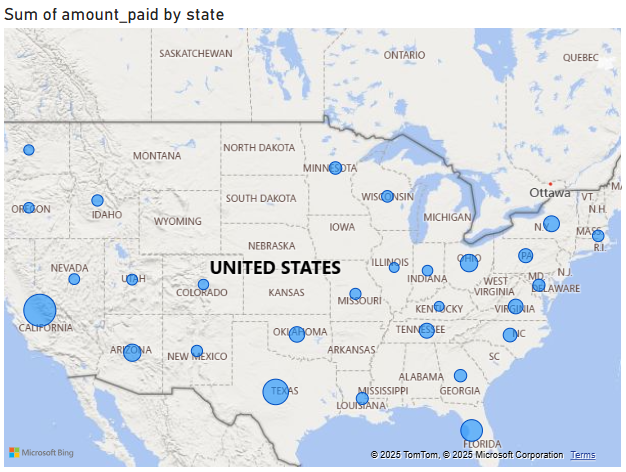

# End-to-End E-commerce Sales Analysis Project

## 1. Project Objective
The goal of this project was to perform an end-to-end data analysis of a fictional e-commerce company, "Gourmet Bytes." The project involved generating a realistic dataset, setting up a relational database, and building an interactive Power BI dashboard to identify key business insights and provide actionable recommendations.

## 2. Tools & Technologies
* **Data Generation:** Python (Pandas, Faker, NumPy)
* **Database:** PostgreSQL
* **ETL & Warehousing:** pgAdmin
* **BI & Visualization:** Microsoft Power BI

## 3. Project Workflow
1.  **Data Generation:** A custom Python script was developed to generate synthetic but realistic data for customers, products, subscriptions, and transactions over a two-year period.
2.  **Database Setup:** The generated CSV files were loaded into a PostgreSQL database. A relational schema was established with primary and foreign keys to link the tables.
3.  **Dashboard Development:** Power BI was connected to the PostgreSQL database to create an interactive dashboard.

## 4. Key Questions Answered by the Dashboard
### The dashboard was designed to answer critical business questions:

1.  What is the total revenue and how is it trending over time and What is our overall customer churn rate?

The total revenue over the last two years is about **$545K**. The revenue trend shows consistent growth with a significant spike in sales during Q4 of each year.

2. Which states are the top contributors to sales?

By analyzing the data, we can see that the states with higher poplutaion density like CA and TX are the top contributors to the sales.

3. Which channels are most effective for acquiring new customers?

The 'Organic Search' channel was most effective in customer acquistion, which acquired about 40% of the total customers, closely followed by 'Paid Social' channel with 30% contribution.

4. Which subscription products are the most popular, and which are the best at retaining subscribers?

The 'Standard Snack Box' product was most popular among majority of subscribers and was re-ordered by most active subscribers as well.

5. What are the biggest drivers behind our total revenue?

This Decomposition Graph gives us overall perspective of biggest source of our total revenue, considering each state, channel and product.

6. Overall Dashboard

