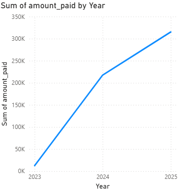
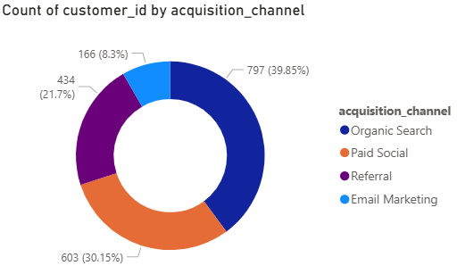

# End-to-End E-commerce Sales Analysis Project

## 1. Project Objective
The goal of this project was to perform an end-to-end data analysis of a fictional e-commerce company, "Gourmet Bytes." The project involved generating a realistic dataset, setting up a relational database, and building an interactive Power BI dashboard to identify key business insights and provide actionable recommendations.

## 2. Tools & Technologies
* **Data Generation:** Python (Pandas, Faker, NumPy)
* **Database:** PostgreSQL
* **ETL & Warehousing:** pgAdmin
* **BI & Visualization:** Microsoft Power BI

## 3. Project Workflow
1.  **Data Generation:** A custom Python script was developed to generate synthetic but realistic data for customers, products, subscriptions, and transactions over a two-year period.
2.  **Database Setup:** The generated CSV files were loaded into a PostgreSQL database. A relational schema was established with primary and foreign keys to link the tables.
3.  **Dashboard Development:** Power BI was connected to the PostgreSQL database to create an interactive dashboard.

## 4. Key Questions Answered by the Dashboard
The dashboard was designed to answer critical business questions:

* What is the total revenue and how is it trending over time and What is our overall customer churn rate?
Our total revenue over the last two years is **$545K**. The revenue trend shows consistent growth with a significant spike in sales during Q4 of each year.

* Which states are the top contributors to sales?

* Which channels are most effective for acquiring new customers?

* Which subscription products are the most popular, and which are the best at retaining subscribers?

* What are the biggest drivers behind our total revenue?

* Overall Dashboard
